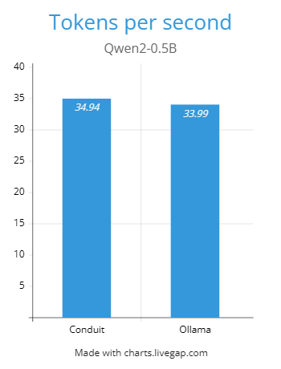
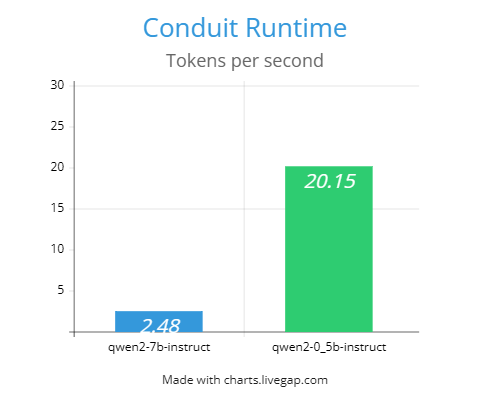

# Conduit Runtime


**Conduit Runtime** is a lightweight local runtime for running **GGUF-based Large Language Models** directly on your machine.

It provides a **simple CLI interface** to install, run, benchmark, and manage open-source models from **HuggingFace**, with automatic hardware-aware tuning.

The goal is to make local LLM experimentation **simple, transparent, and hackable**.

---

# Why Conduit?

Running local models often requires complex tooling and configuration.

Conduit simplifies the entire process:

```
Install model → Run model → Benchmark performance
```

All from a single CLI tool.

Conduit automatically adapts to your hardware to maximize performance.

---

# Core Features

### Local LLM Runtime

Run GGUF models directly on your machine without cloud APIs.

Supports CPU inference with automatic optimization.

---

### HuggingFace GGUF Model Installer

Install models directly from HuggingFace repositories.

```
conduit pull Qwen/Qwen2-0.5B-Instruct-GGUF
```

Conduit automatically finds compatible GGUF files.

---

### Automatic Quantization Selection

Conduit analyzes your hardware and selects the **best quantization format** that fits in RAM.

Supported quant types include:

```
Q8_0
Q6_K
Q5_K_M
Q4_K_M
Q3_K_M
Q2_K
```

This ensures models run reliably even on smaller systems.

---

### Runtime Hardware Tuning

Conduit automatically configures runtime parameters based on your system.

Optimizations include:

* CPU thread selection
* context window tuning
* batch size tuning
* RAM safety margins
* KV cache estimation

This ensures models run efficiently without manual configuration.

---

### Streaming Token Generation

Responses stream token-by-token directly in the terminal for a smooth interactive experience.

---

### CLI Command Interface

Conduit provides a clean command-line interface for managing models.

Available commands:

```
conduit run
conduit pull
conduit ls
conduit remove
conduit bench
```

---

### Built-in Benchmarking

Measure real model performance on your machine.

Metrics include:

* First token latency
* Total generation time
* Tokens generated
* Tokens per second

---

### Resume-Safe Model Downloads

Downloads support automatic resume if interrupted.

Large models can continue downloading without restarting.

---

### Markdown Rendering in Terminal

Generated responses are rendered using Markdown formatting for improved readability.

---

# Installation

Clone the repository:

```
git clone https://github.com/Dev-Nonsense0909688/Conduit-Runtime
cd Conduit-Runtime
```

Install Conduit:

```
pip install -e .
```

This installs the **conduit CLI command globally**.

Verify installation:

```
conduit
```

---

# Quick Start

Install a model:

```
conduit pull Qwen/Qwen2-0.5B-Instruct-GGUF
```

Run the model:

```
conduit run qwen2-0.5b-instruct
```

Benchmark the model:

```
conduit bench qwen2-0.5b-instruct
```

---

# CLI Commands

### Run a Model

```
conduit run <model>
```

Example:

```
conduit run qwen2-0.5b-instruct
```

---

### Install a Model

```
conduit pull <huggingface_repo>
```

Example:

```
conduit pull Qwen/Qwen2-0.5B-Instruct-GGUF
```

---

### Install with Specific Quantization

```
conduit pull <repo> <quant>
```

Example:

```
conduit pull Qwen/Qwen2-7B-Instruct-GGUF q5_k_m
```

---

### List Installed Models

```
conduit ls
```

---

### Remove a Model

```
conduit remove <model>
```

---

### Benchmark Model Performance

```
conduit bench <model>
```

---

# Example Benchmark Output

```
Benchmark Results

First Token Latency:   1.05s
Total Generation Time: 21.59s
Tokens Generated:      78
Tokens/sec:            3.61
```

---

# Supported Models

Conduit works with any HuggingFace repository that provides **GGUF models**.

Common supported model families include:

* LLaMA
* Mistral
* Qwen
* Phi
* Gemma
* DeepSeek
* CodeLlama

---

# Hardware Requirements

Minimum recommended:

```
8 GB RAM
Modern x64 CPU
```

Typical CPU performance:

| Model Size | Tokens/sec |
| ---------- | ---------- |
| 3B         | 7 – 12     |
| 7B         | 3 – 6      |
| 13B        | 1 – 3      |

Actual performance depends on CPU architecture and memory speed.

---

# Graphs

## Benchmark (Qwen2-0.5B CPU) [Single Run]


### Test Conditions:-

  - Processor	Intel(R) Core(TM) i5-7600 CPU @ 3.50GHz   3.50 GHz
  - Installed RAM	8.00 GB (7.89 GB usable)
  - Storage	932 GB SSD CT1000BX500SSD1
  - Graphics Card	Intel(R) HD Graphics 630 (128 MB)
  - System Type	64-bit operating system, x64-based processor


## Tokens per Second of different Models




# Project Goals

Conduit is designed to be:

* minimal
* transparent
* easy to understand
* easy to extend
* developer friendly

Unlike heavy LLM frameworks, Conduit focuses on **clarity and hackability**.

---

# Architecture

High-level architecture:

```
CLI Layer
   ↓
Runtime Engine
   ↓
Providers (HuggingFace)
   ↓
Local Model Execution
```

This modular design allows new providers or runtimes to be added easily.

---

# License

MIT License

# Conduit Runtime


**Conduit Runtime** is a lightweight local runtime for running **GGUF-based Large Language Models** directly on your machine.

It provides a **simple CLI interface** to install, run, benchmark, and manage open-source models from **HuggingFace**, with automatic hardware-aware tuning.

The goal is to make local LLM experimentation **simple, transparent, and hackable**.

---

# Why Conduit?

Running local models often requires complex tooling and configuration.

Conduit simplifies the entire process:

```
Install model → Run model → Benchmark performance
```

All from a single CLI tool.

Conduit automatically adapts to your hardware to maximize performance.

---

# Core Features

### Local LLM Runtime

Run GGUF models directly on your machine without cloud APIs.

Supports CPU inference with automatic optimization.

---

### HuggingFace GGUF Model Installer

Install models directly from HuggingFace repositories.

```
conduit pull Qwen/Qwen2-0.5B-Instruct-GGUF
```

Conduit automatically finds compatible GGUF files.

---

### Automatic Quantization Selection

Conduit analyzes your hardware and selects the **best quantization format** that fits in RAM.

Supported quant types include:

```
Q8_0
Q6_K
Q5_K_M
Q4_K_M
Q3_K_M
Q2_K
```

This ensures models run reliably even on smaller systems.

---

### Runtime Hardware Tuning

Conduit automatically configures runtime parameters based on your system.

Optimizations include:

* CPU thread selection
* context window tuning
* batch size tuning
* RAM safety margins
* KV cache estimation

This ensures models run efficiently without manual configuration.

---

### Streaming Token Generation

Responses stream token-by-token directly in the terminal for a smooth interactive experience.

---

### CLI Command Interface

Conduit provides a clean command-line interface for managing models.

Available commands:

```
conduit run
conduit pull
conduit ls
conduit remove
conduit bench
```

---

### Built-in Benchmarking

Measure real model performance on your machine.

Metrics include:

* First token latency
* Total generation time
* Tokens generated
* Tokens per second

---

### Resume-Safe Model Downloads

Downloads support automatic resume if interrupted.

Large models can continue downloading without restarting.

---

### Markdown Rendering in Terminal

Generated responses are rendered using Markdown formatting for improved readability.

---

# Installation

Clone the repository:

```
git clone https://github.com/Dev-Nonsense0909688/Conduit-Runtime
cd Conduit-Runtime
```

Install Conduit:

```
pip install -e .
```

This installs the **conduit CLI command globally**.

Verify installation:

```
conduit
```

---

# Quick Start

Install a model:

```
conduit pull Qwen/Qwen2-0.5B-Instruct-GGUF
```

Run the model:

```
conduit run qwen2-0.5b-instruct
```

Benchmark the model:

```
conduit bench qwen2-0.5b-instruct
```

---

# CLI Commands

### Run a Model

```
conduit run <model>
```

Example:

```
conduit run qwen2-0.5b-instruct
```

---

### Install a Model

```
conduit pull <huggingface_repo>
```

Example:

```
conduit pull Qwen/Qwen2-0.5B-Instruct-GGUF
```

---

### Install with Specific Quantization

```
conduit pull <repo> <quant>
```

Example:

```
conduit pull Qwen/Qwen2-7B-Instruct-GGUF q5_k_m
```

---

### List Installed Models

```
conduit ls
```

---

### Remove a Model

```
conduit remove <model>
```

---

### Benchmark Model Performance

```
conduit bench <model>
```

---

# Example Benchmark Output

```
Benchmark Results

First Token Latency:   1.05s
Total Generation Time: 21.59s
Tokens Generated:      78
Tokens/sec:            3.61
```

---

# Supported Models

Conduit works with any HuggingFace repository that provides **GGUF models**.

Common supported model families include:

* LLaMA
* Mistral
* Qwen
* Phi
* Gemma
* DeepSeek
* CodeLlama

---

# Hardware Requirements

Minimum recommended:

```
8 GB RAM
Modern x64 CPU
```

Typical CPU performance:

| Model Size | Tokens/sec |
| ---------- | ---------- |
| 3B         | 7 – 12     |
| 7B         | 3 – 6      |
| 13B        | 1 – 3      |

Actual performance depends on CPU architecture and memory speed.

---

# Project Goals

Conduit is designed to be:

* minimal
* transparent
* easy to understand
* easy to extend
* developer friendly

Unlike heavy LLM frameworks, Conduit focuses on **clarity and hackability**.

---

# Architecture

High-level architecture:

```
CLI Layer
   ↓
Runtime Engine
   ↓
Providers (HuggingFace)
   ↓
Local Model Execution
```

This modular design allows new providers or runtimes to be added easily.

---

# Contributing

Contributions are welcome.

Possible areas for improvement:

* additional model providers
* GPU acceleration
* improved runtime tuning
* additional benchmarking tools
* model management improvements

---

# License

MIT License

## Roadmap / TODO

Planned improvements for Conduit Runtime.

### Core Runtime

* [ ] Improve runtime auto-tuning accuracy
* [ ] Better context length estimation
* [ ] Dynamic batch size tuning
* [ ] Improved KV cache estimation
* [ ] Faster model loading

### Model Management

* [ ] Model registry system
* [ ] Model metadata caching
* [ ] Model version tracking
* [ ] Automatic model updates
* [ ] Disk usage management

### CLI Improvements

* [ ] `conduit doctor` system diagnostics
* [ ] `conduit info <model>` command
* [ ] `conduit update` command
* [ ] Better progress indicators
* [ ] Colored CLI tables

### Providers

* [ ] Additional model providers
* [ ] Direct GGUF index support
* [ ] HuggingFace search improvements
* [ ] Model compatibility detection

### Performance
* [ ] Multi-thread scheduling improvements
* [ ] Faster tokenizer loading
* [ ] Optimized streaming output

### Developer Experience

* [ ] Python API
* [ ] Plugin system for commands
* [ ] Config file support
* [ ] Better logging system

### Documentation

* [ ] Architecture documentation
* [ ] CLI examples
* [ ] Performance tuning guide
* [ ] Model compatibility list
* [ ] Troubleshooting section


