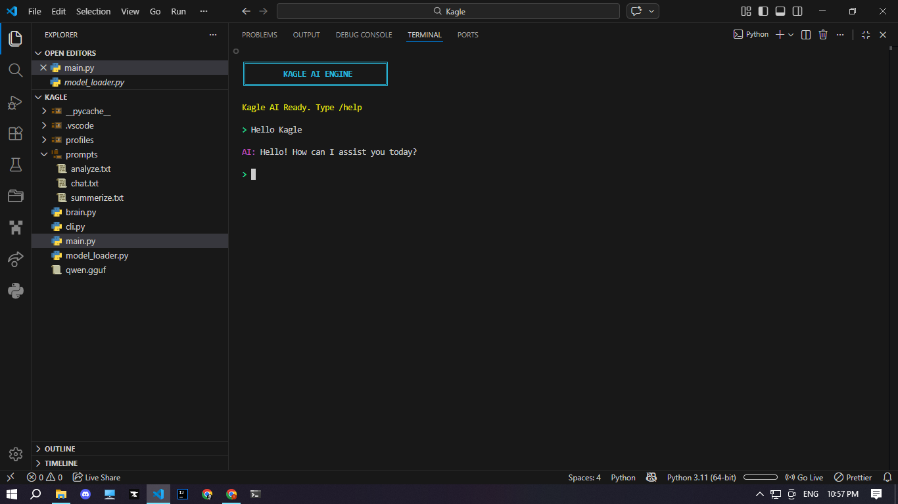

<p align="center">
  
</p>

<h1 align="center">Kagle Engine</h1>

<p align="center">
Lightweight local AI CLI assistant for CPU-only systems
</p>

# Kagle Engine

Kagle is a simple local AI assistant that runs directly on your computer.
It is designed to work on low-RAM, CPU-only systems and small local models.

The project focuses on keeping things lightweight while still providing useful AI features like chat, file analysis, and code generation.

## What Kagle Can Do

* Run a local AI model (GGUF format)
* Stream responses in real time
* Analyze and summarize files
* Scan directories
* Show system statistics
* Generate and write files using AI
* Work through a terminal interface

## Requirements

You need Python 3.10 or newer.

Install the dependencies:

pip install llama-cpp-python textual psutil colorama

## Running Kagle

Start the interface with:

python main.py

## Commands
```
/help – show available commands
/analyze <file> – analyze the structure of a file
/read <file> – summarize a file
/scan – list files in the current folder
/stats – show CPU and RAM usage
/write – generate a file with AI
/reload – reload the model
/context <number> – change context memory
/clear – clear chat history
/exit – close Kagle
```
## Notes

Kagle is built to run on normal machines without a GPU.
Performance will depend on the model size and CPU speed.

Kagle requires a GGUF model to run.
model: `https://huggingface.co/Qwen/Qwen2-1.5B-Instruct-GGUF/blob/main/qwen2-1_5b-instruct-q4_k_m.gguf`

Download a GGUF file and place it in the project folder.
```
Kagle/
├─ qwen.gguf
├─ brain.py
├─ cli.py
```

## License

Open source.

## Screenshots

<p align="center">
  
</p>


## TODO
`TODO: Make the tool-chain module for getting system_data.`

